<h1>Cloud-Native SIEM — Azure Monitor & Microsoft Sentinel</h1>

<h2>Description</h2>
Internship project (Smartovate Ltd) to deploy a cloud-native SIEM on Microsoft Azure. The project centralizes security event logs (identity, activity, endpoint) into a Log Analytics Workspace and layers Microsoft Sentinel on top for detection, correlation, and incident response — built and documented across four agile sprints.
<br />

<h2>Languages and Utilities Used</h2>
- <b>Microsoft Azure Portal</b>
- <b>Microsoft Sentinel</b>
- <b>Azure Monitor / Log Analytics Workspace</b>
- <b>KQL</b> (Kusto Query Language)
- <b>Microsoft Entra ID</b>
- <b>Azure Monitor Agent (AMA) & Data Collection Rules</b>

<h2>Environments Used</h2>
- <b>Azure subscription:</b> Smartovate (shared class tenant)
- <b>Region:</b> East US
- <b>Resource group:</b> SoumayaArfaoui

<h2>Sprint Division</h2>

| Sprint | Epic | Focus | Status |
|---|---|---|---|
| [Sprint 1](#sprint-1--base-infrastructure) | Epic 1 — Base Infrastructure | Log Analytics Workspace + Sentinel activation | ✅ Complete |
| [Sprint 2](#sprint-2--data-source-integration) | Epic 2 — Data Source Integration | Entra ID logs, Azure Activity logs, AMA on VMs | ✅ Complete |
| [Sprint 3](#sprint-3--threat-detection) | Epic 3 — Threat Detection and Alerting | Native detection rules, custom KQL rules | ✅ Complete |
| Sprint 4 | Epic 4 — TBD | TBD | ⬜ Not started |

---

<h2 id="sprint-1--base-infrastructure">Sprint 1 — Base Infrastructure</h2>

<b>Epic 1:</b> Deployment and Configuration of the Base Infrastructure
<br />
<b>Status:</b> ✅ Complete

<h3>Description</h3>
Deploy the foundational logging backbone for the SIEM: a centralized Log Analytics Workspace, and Microsoft Sentinel activated on top of it with correct RBAC access.

<h3>US 1.1 — Creation of the Log Analytics Workspace</h3>

*As a security engineer, I want to deploy a Log Analytics Workspace, in order to centralize the storage of all event logs.*
**Priority:** High

| Acceptance criteria | Status | Evidence |
|---|---|---|
| Workspace created in the appropriate Azure region | ✅ Done | `law-smartovate-siem`, region East US, resource group `SoumayaArfaoui` |
| Data retention configured to a minimum of 90 days | ✅ Done | 90-day retention (free tier while Sentinel is active) |
| Billing and environment tags applied | ✅ Done | Tag `project: SIEM-Sentinel` |

<h3>US 1.2 — Activation of Microsoft Sentinel</h3>

*As a security engineer, I want to activate Microsoft Sentinel on the Log Analytics Workspace, in order to benefit from SIEM capabilities.*
**Priority:** High

| Acceptance criteria | Status | Evidence |
|---|---|---|
| Sentinel successfully activated on the target workspace | ✅ Done | Activated on `law-smartovate-siem`, 31-day free trial (10 GB/day, until 17/08/2026) |
| RBAC roles (Sentinel Contributor, Sentinel Reader) defined and assigned | ✅ Done | Confirmed via Access control (IAM) → Check access: Sentinel Contributor, Sentinel Reader, Sentinel Automation Contributor |

<h3>Issue Encountered & Resolved</h3>
**Problem:** Guest account (Gmail-based) could not be found via the standard "Select members" search when assigning Sentinel roles — an Entra ID guest-enumeration restriction.
<br />
**Resolution:** Subscription Owner (Abdelhalek Bakkari) assigned the roles directly, bypassing the search.
<br />
**Verification:** Confirmed via Access control (IAM) → Check access.

<h3>Program walk-through</h3>
<p align="center">

Search for and create the Log Analytics Workspace: <br/>
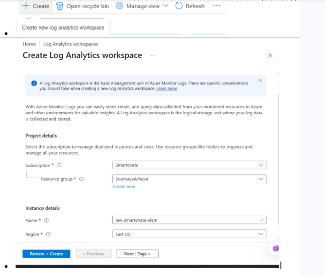
<br />
<br />


Confirm 90-day retention setting: <br/>
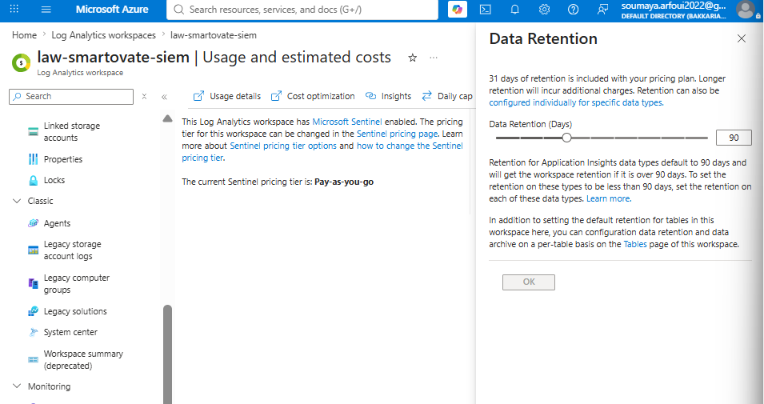
<br />
<br />

Confirm tags applied: <br/>
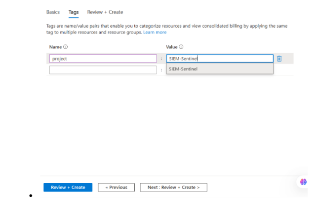
<br />
<br />

Add Microsoft Sentinel to the workspace: <br/>
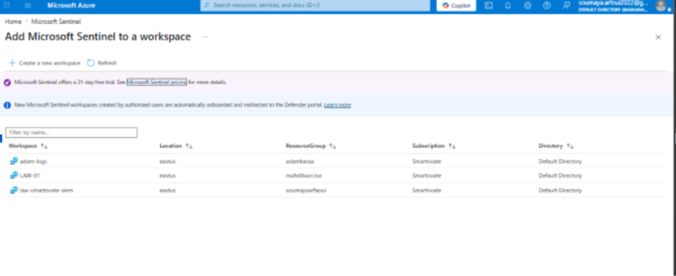
<br />
<br />
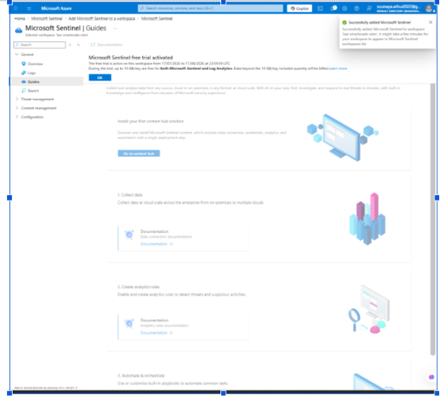
<br />
<br />


<br />
<br />

Confirm RBAC roles assigned (Check access): <br/>


</p>

<h3>Sprint 1 Summary</h3>

| User Story | Completion |
|---|---|
| US 1.1 — Log Analytics Workspace | ✅ 100% |
| US 1.2 — Microsoft Sentinel activation | ✅ 100% |

**Sprint 1 status: fully complete, no open blockers.**

---

<h2 id="sprint-2--data-source-integration">Sprint 2 — Data Source Integration</h2>

<b>Epic 2:</b> Data Source Integration
<br />
<b>Status:</b> ✅ Complete

<h3>Description</h3>
Connect the SIEM's core data sources: Microsoft Entra ID identity logs, Azure Activity (resource-level) logs, and endpoint telemetry from test VMs via the Azure Monitor Agent — so Sentinel has real data to detect against in Sprint 3.

<h3>US 2.1 — Connecting Azure Active Directory logs</h3>

*As a cloud administrator, I want to connect Azure AD sign-in and audit logs to Sentinel, in order to monitor authentications and identity changes.*
**Priority:** High

| Acceptance criteria | Status | Evidence |
|---|---|---|
| The Azure Active Directory (Microsoft Entra ID) data connector is enabled | ✅ Done | Data connectors → Microsoft Entra ID shows **Connected** status, live ingestion graph, last log ~8 min ago |
| The "SigninLogs" and "AuditLogs" tables are visible in the KQL query interface | ✅ Done | `SigninLogs \| take 10` and `AuditLogs \| take 10` both return real rows (sign-in activity, user/password/security-info updates) |
| Maximum delay of 15 minutes between an event and its appearance in Sentinel | ✅ Done | `SigninLogs \| extend delay = ingestion_time() - TimeGenerated \| project TimeGenerated, ingestion_time(), delay \| take 5` — tested over Last 24 hours and re-tested over Last 7 days: delay consistently between ~45 seconds and ~1.5 minutes, well within the 15-minute requirement |

<h4>Issue Encountered & Resolved</h4>
**Problem:** Earlier testing (Sprint 2 start) showed an ingestion delay of roughly 30 minutes for SigninLogs, exceeding the 15-minute acceptance criterion.
<br />
**Resolution:** No manual fix applied — re-tested later in the sprint once the Entra ID connector and ingestion pipeline had stabilized. A 7-day sample confirmed consistent delay under 2 minutes.
<br />
**Verification:** KQL delay query re-run across a 24-hour and a 7-day window, both showing sub-2-minute delay.

<h3>US 2.2 — Collecting Azure Activity logs</h3>

*As a security analyst, I want to ingest Azure Activity logs, in order to trace changes made to infrastructure resources.*
**Priority:** Medium

| Acceptance criteria | Status | Evidence |
|---|---|---|
| The Azure Activity connector is configured via diagnostic settings at the subscription level | ✅ Done | Diagnostic setting created under Subscriptions → Activity log → Diagnostic settings, destination = `law-smartovate-siem` |
| Resource creation, modification, and deletion events flow into the AzureActivity table | ✅ Done | `AzureActivity \| take 10` returns real events (e.g., VIRTUALMACHINES/START/ACTION, WORKSPACES/WRITE) across multiple resource groups |

<h4>Issue Encountered & Resolved</h4>
**Problem:** The standard Content Hub "Azure Activity" connector requires configuration via Azure Policy, which requires the Owner role at the subscription level — held only by Contributor, which explicitly excludes `Microsoft.Authorization/PolicyAssignments/write`.
<br />
**Resolution:** Bypassed the Policy-based connector by creating a direct diagnostic setting on the subscription's Activity log, pointing to the Log Analytics workspace — achieves the same data flow without requiring Owner-level Policy permissions.
<br />
**Verification:** `AzureActivity` table populated with live events; diagnostic setting visible and enabled in the portal.

<h3>US 2.3 — Deployment of the Azure Monitor Agent on VMs</h3>

*As a systems engineer, I want to deploy the Azure Monitor Agent (AMA) on a sample of virtual machines, in order to collect system events (Windows Event Logs / Syslog).*
**Priority:** High

| Acceptance criteria | Status | Evidence |
|---|---|---|
| A Data Collection Rule (DCR) is created to specify which events to collect | ✅ Done | DCR created and associated with both `vm-windows` and the Linux VM, specifying Windows Security Events and Syslog facilities |
| AMA agent installed on at least one Windows VM and one Linux VM | ✅ Done | Extensions on `vm-windows` show AzureMonitorWindowsAgent Running; Linux VM shows AzureMonitorLinuxAgent Running |
| Security events (e.g., Event ID 4624) ingested into the SecurityEvent table | ✅ Done | `SecurityEvent \| where EventID == 4624 \| take 10` returns real sign-in events from `vm-windows` |

<h4>Issue Encountered & Resolved</h4>
**Problem:** VM quota blocker — the B-series VM family was capped at 4 vCPUs subscription-wide, fully used, blocking creation of the second (Linux) test VM.
<br />
**Resolution:** Self-service quota increase request submitted via Azure "Manage Quota" — approved instantly, raising the limit from 4 to 8 vCPUs.
<br />
**Verification:** Both `vm-windows` and the Linux VM created and running without further quota errors.

<h3>Program walk-through</h3>
<p align="center">

Microsoft Entra ID connector — connected status and ingestion graph: <br/>
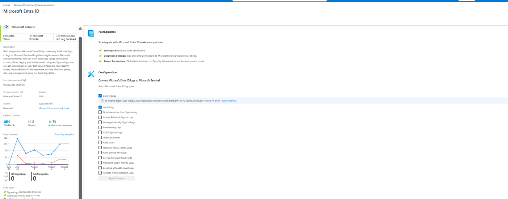
<br />
<br />

AzureActivity events flowing (deletions, creations, modifications): <br/>

<br />
<br />

AuditLogs visible in KQL: <br/>
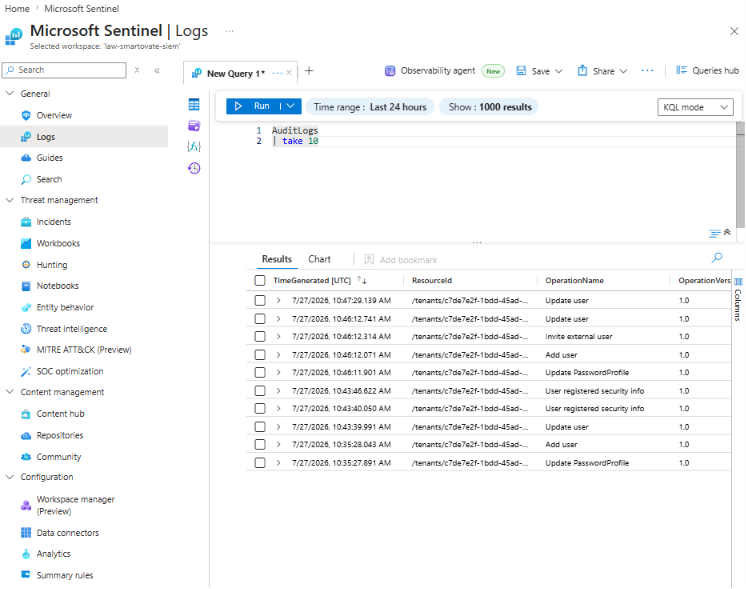
<br />
<br />

SigninLogs visible in KQL: <br/>
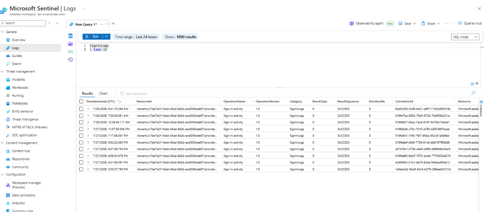
<br />
<br />

Ingestion delay confirmed under 2 minutes (7-day sample): <br/>
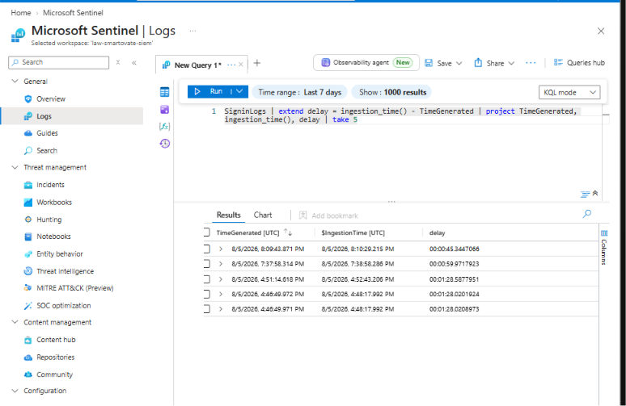
<br />
<br />


<br />

Data Collection Rule (DCR) configuration: <br/>
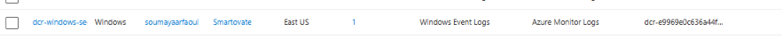
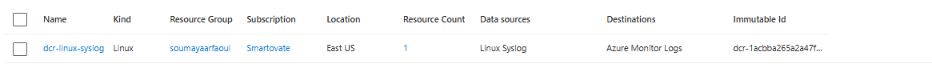

<br />
<br />

AMA agent status on Windows and Linux VMs: <br/>
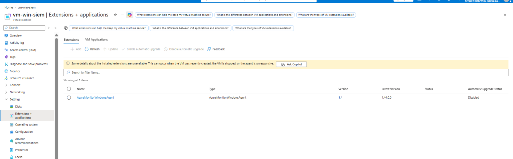
<br />
<br />
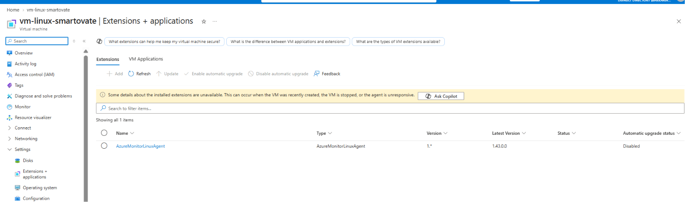
<br />
<br />

SecurityEvent Event ID 4624 ingested: <br/>
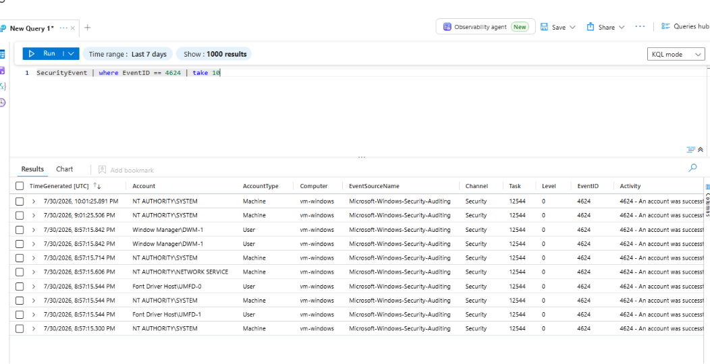

</p>

<h3>Sprint 2 Summary</h3>

| User Story | Completion |
|---|---|
| US 2.1 — Connect Azure AD (Entra ID) logs | ✅ 100% |
| US 2.2 — Collect Azure Activity logs | ✅ 100% |
| US 2.3 — Deploy AMA on Windows + Linux VMs | ✅ 100% |

**Sprint 2 status: fully complete. Two workarounds documented (diagnostic-setting bypass for Azure Activity, VM quota self-service increase); ingestion delay re-tested and confirmed within acceptance criteria after an initial ~30-minute observation.**

# Sprint 3 — Detailed Rule-by-Rule Testing Log

**Purpose of this document:** a personal working record of exactly how each of the 7 active Sentinel rules was tested — what the rule does, what action was taken to trigger it, where to find the proof, and why it matters. Use this to reconstruct any test later, or as source material for the final README.

**Active rules overview (7 total — 4 High, 2 Medium, 1 Low):**

| Rule | Severity | Type | Status in this log |
|---|---|---|---|
| New User Assigned to Privileged Role (DET-10) | High | Native | ✅ Fully tested & confirmed |
| Mass Azure Resource Deletion | High | Custom | ✅ Fully tested & confirmed |
| Azure RBAC (Elevate Access) | High | Native | ⏳ Not yet tested |
| Suspicious Resource deployment | High | Native | ⏳ Not yet tested |
| Account created or deleted by non-approved user | Medium | Native | 🔶 Configured, test pending confirmation |
| Brute Force Sign-in Detection - Custom | Medium | Custom | 🔶 Test attempted, not yet confirmed firing |
| New CloudShell User | Low | Native | ⏳ Not yet tested (trivial) |

**All 7 active rules (overview screenshot):**


---

## 1. New User Assigned to Privileged Role — ✅ Confirmed

**Severity:** High | **Tactic:** Privilege Escalation (T1078) | **Source:** Microsoft Entra ID
**Actual underlying rule name shown in Defender:** *DET-10 - Suspicious Azure or Entra Role Elevation*

### What it detects
Flags when a privileged Azure RBAC or Microsoft Entra administrative role is assigned or activated for an account that didn't already hold it. The KQL specifically compares the current hour's role assignments against the prior 14 days (`join kind=leftanti`) — so it only fires on a **genuinely new** privilege grant, not a routine reassignment or PIM renewal.

### Why this matters
This is the classic privilege-escalation attack pattern: an attacker compromises a low-privilege account, then quietly grants it admin rights. Catching *new* admin-role grants (not just any admin activity) is the strongest, least-noisy signal of this happening.

### Test scenario — what was actually done
1. Confirmed via Entra ID that the account had **Global Administrator** rights (separate from Azure subscription RBAC, where only Contributor was held)
2. Went to **Entra ID → Roles and administrators → User Administrator → + Add assignments**
3. Selected assignment type **Active** (not Eligible/PIM — Eligible roles don't log an audit event until manually activated)
4. Assigned the role to a pre-existing test account: **`DET04 entra Brute Force Test`** (`DET04Test@bakkariabdelkhalekhotmail.onmicrosoft.com`) — chosen because it was already a dedicated test account in the shared tenant, safer than using a real classmate's account
5. Confirmed the raw event landed in `AuditLogs`:
   ```kql
   AuditLogs
   | where TimeGenerated between (datetime(2026-08-11T10:49:55Z) .. datetime(2026-08-11T10:50:05Z))
   | project TimeGenerated, ActivityDisplayName, Category, InitiatedBy, TargetResources
   ```
   Confirmed: `ActivityDisplayName = "Add member to role"`, `Category = "RoleManagement"`
6. Waited ~19 minutes for the scheduled rule run

### Where the evidence lives
- **Incident #495**, title: *"Privileged role User Administrator assigned in Microsoft Entra"*
- Severity: **Élevé (High)** — correct
- Alert detail panel shows full plain-language explanation: *"User Administrator was assigned to DET04Test@bakkariabdelkhalekhotmail.onmicrosoft.com by soumaya.arfoui2022_gmail.com#EXT#@bakkariabdelkhalekhotmail.onmicrosoft.com"*
- Structured event table confirms: Actor, ActorIPAddress (197.0.144.252), TargetIdentity (DET04), TargetPrincipalType (User), AssignedRoleName (User Administrator)
- MITRE category: **Privilege Escalation**
- First/last activity: 11:50:00 — Generated: 12:09:19 (≈19 min detection latency)

**Incident detail screenshot:**


2. Mass Azure Resource Deletion — ✅ Confirmed

Severity: High | Tactic: Impact | Source: Custom Content (custom KQL rule)

What it detects

Counts resource deletions per user within a rolling 10-minute window. Fires when the same person deletes 5 or more resources in that window.

kql
AzureActivity
| where OperationNameValue has "delete"
| where ActivityStatusValue == "Success"
| summarize DeleteCount = count() by Caller, bin(TimeGenerated, 10m)
| where DeleteCount >= 5
Why this matters

A single deletion is normal cleanup. Five-plus deletions by the same account in a short window is a pattern — either a scripted mass-cleanup gone wrong, or an attacker destroying evidence or infrastructure. The threshold is what separates routine housekeeping from something alert-worthy.

Test scenario — what was actually done

Created and then deleted 6 separate test resources (resource groups) in quick succession, all under the same account, within the rule's 10-minute window — comfortably clearing the DeleteCount >= 5 threshold.

Note on evidence: only one deletion is shown as a representative screenshot below (the test-delete-1 resource group) rather than all 6 individually — the incident evidence (DeleteCount = 6) is what confirms the full test was carried out correctly.

Where the evidence lives
Incident: "Mass Azure Resource Deletion", severity Élevé (High) — correct, matches rule config
Alert detail confirms: Caller = soumaya.arfoui2022@gmail.com, DeleteCount = 6, TimeGenerated = 31 juil. 2026 03:00:00
Alert category: Impact — matches MITRE tactic mapping
Detection source: Scheduled detection, Microsoft Sentinel

Test action (one representative example — test-delete-1 resource group, one of 6 deletions performed): 

Incident evidence (confirms all 6 deletions were detected, DeleteCount = 6): 

. Azure RBAC (Elevate Access) — ✅ Confirmed

Severity: High | Tactic: Privilege Escalation (T1078) | Source: Microsoft Entra ID (native template)

What it detects

Detects when a Global Administrator uses the "Access management for Azure resources" toggle to elevate their own access — this grants User Access Administrator at the tenant's root scope, meaning full access to every subscription and management group in the tenant. It's one of the most powerful privilege-escalation actions available in Azure, since it goes from "identity admin" to "resource owner everywhere" with a single toggle.

kql
AuditLogs
| where Category =~ "AzureRBACRoleManagementElevateAccess"
| where ActivityDisplayName =~ "User has elevated their access to User Access Administrator for their Azure Resources"
| extend Actor = tostring(InitiatedBy.user.userPrincipalName)
| extend IPAddress = tostring(InitiatedBy.user.ipAddress)
| project TimeGenerated, Actor, OperationName, IPAddress, Result, LoggedByService
Why this matters

This toggle is legitimate but rarely used — most Global Admins never need Azure resource access, since identity administration and resource administration are normally separate permission systems. Any use of it should be reviewed, since it's an easy way for a compromised admin account (or an insider) to gain sweeping resource-level control.

Test scenario — what was actually done
Went to Entra ID → Properties
Found the "Access management for Azure resources" toggle, currently showing the account already has Global Administrator rights in this tenant
Toggled it to Yes
Portal immediately confirmed: "Soumaya Arfaoui (soumaya.arfoui2022@gmail.com) can manage access to all Azure subscriptions and management groups in this tenant" — with a visible warning banner: "You have 1 users with elevated access. Microsoft Security recommends deleting access for users who have unnecessary elevated access."

Toggle enabled — evidence: 

Where the evidence lives
Incident ID 31: "Azure RBAC (Elevate Access)", severity Élevé (High)
First activity: 30 juil. 2026 22:56:07 — Last activity: 23:12:11 — Alert generated: 23:38:30
Alert category: Réaffectation de privilèges (Privilege reassignment)
MITRE technique: T1078
Alert description (auto-generated by the template) confirms exact match to the rule's purpose: "Detects when a Global Administrator elevates access to all subscriptions and management groups in a tenant..."
Entity graph shows the account (live.com#soumaya.arfoui2022) and source IP (197.0.215.40)

Incident evidence: 
## 4. Suspicious Resource deployment — ⏳ Not yet tested

**Severity:** High | **Tactic:** Impact (T1496) | **Source:** Azure Activity (native template)

### What it detects
Native template looking for anomalous resource deployment patterns — e.g. deployments via unusual methods, unexpected regions, or naming patterns inconsistent with normal activity.

### Test scenario — what to do
Deploy a resource via an unusual method (e.g. a raw ARM/Bicep template deployment rather than the normal portal "Create resource" flow), or deploy into a region not otherwise used in this project.

### Where to look for evidence
Sentinel → Incidents, filtered to this rule name, after the deployment and the rule's next scheduled run.

---

## 5. Account created or deleted by non-approved user — 🔶 Configured, pending confirmation

**Severity:** Medium | **Tactic:** Initial Access (T1078, T1078.004) | **Source:** Microsoft Entra ID (native template, blocklist-based)

### What it detects
Watches for `AuditLogs` "Add user" / "Delete user" events performed by a specific listed account. Original template design: put a *known bad* account in the list, get alerted if they create/delete users.

### Configuration used
```kql
let nonapproved_users = dynamic(["soumaya.arfoui2022_gmail.com#EXT#@bakkariabdelkhalekhotmail.onmicrosoft.com"]);
let nonapproved_apps = dynamic([]);
AuditLogs
| where OperationName =~ "Add user" or OperationName =~ "Delete user"
| where Result =~ "success"
| extend InitiatingUserPrincipalName = tostring(InitiatedBy.user.userPrincipalName)
| where InitiatingUserPrincipalName has_any (nonapproved_users) or InitiatingAppName has_any (nonapproved_apps)
```
Own guest UPN used as the "watched" account — a pragmatic choice for a shared classroom tenant where a full allowlist of ~35 students isn't realistic.

### Test scenario — what to do
1. Entra ID → Users → **+ New user** → create a throwaway test user (e.g. `test-detection-user`)
2. Delete that same test user shortly after

### Where to look for evidence
```kql
AuditLogs
| where TimeGenerated > ago(30m)
| where OperationName =~ "Add user" or OperationName =~ "Delete user"
| where InitiatedBy.user.userPrincipalName has "soumaya"
```
Then Sentinel → Incident: 


**Status note:** rule is correctly configured and query logic verified; live end-to-end incident confirmation still outstanding as of this log.


---

Brute Force Sign-in Detection - Custom — ✅ Confirmed

Severity: Medium | Tactic: Credential Access | Source: Custom Content (custom KQL rule, Windows SecurityEvent)

What it detects

Detects multiple failed Windows login attempts followed by a successful login on the same host. Unlike the Entra ID sign-in brute-force pattern, this rule reads SecurityEvent (collected by AMA from vm-windows), watching specifically for Event ID 4625 (failed logon) and Event ID 4624 (successful logon) for the same account/computer/IP combination.

kql
SecurityEvent
| where TimeGenerated >= ago(1h)
| where EventID in (4624, 4625)
| extend NormalizedAccount = tolower(tostring(split(Account, "\\")[1]))
| summarize
    FailedCount = countif(EventID == 4625),
    SuccessCount = countif(EventID == 4624),
    FirstFailedAttempt = minif(TimeGenerated, EventID == 4625),
    LastSuccessAttempt = maxif(TimeGenerated, EventID == 4624)
    by NormalizedAccount, Computer, IpAddress
| where FailedCount >= 5 and SuccessCount > 0
| where LastSuccessAttempt > FirstFailedAttempt
Why this matters

A failed login followed eventually by a success is normal (a typo, a forgotten password). But 5+ failures immediately followed by a success, for the same account on the same host, is the classic signature of either a successful brute-force attack or a legitimate user under active attack who happened to succeed after the attacker gave up.
 

7. SSH - Potential Brute Force — ✅ Confirmed

Severity: Medium | Tactic: Credential Access (T1110) | Source: Syslog (native template)

What it detects: an IP with 15+ failed SSH attempts against invalid usernames, in a 4-hour block, grouped by IP + username.

kql
let threshold = 15;
Syslog
| where ProcessName =~ "sshd"
| where SyslogMessage contains "Failed password for invalid user"
| parse kind=relaxed SyslogMessage with * "invalid user " user " from " ip " port" port " ssh2" *
| distinct TimeGenerated, Computer, user, ip, port, SyslogMessage, _ResourceId
| summarize PerHourCount = count() by bin(TimeGenerated,4h), ip, Computer, user
| where PerHourCount > threshold

Blocker overcome: Linux VM uses SSH key-only auth by default. Root cause: an override in /etc/ssh/sshd_config.d/60-cloudimg-settings.conf re-disabling password auth. Fixed by patching that file and restarting ssh.

🐛 Design limitation found: rule groups by user. Spreading attempts across many different fake usernames (once each) never crossed the threshold — a real attacker spraying usernames would evade this rule. Fix: repeated one username (fakeuser1) many times instead; confirmed PerHourCount = 23.

Test: ssh -o PubkeyAuthentication=no -o PreferredAuthentications=password fakeuser1@<linux-vm-ip>, repeated with wrong passwords.


Evidence: Incident ID 912, Severity Medium, Category Credential Access, MITRE T1110. IPAddress 102.158.27.73, UserList ["fakeuser1"], ComputerList ["vm-linux-smartovate"].


Cleanup: revert SSH config to key-only, deallocate the VM, close duplicate incidents #910/#911.

---


