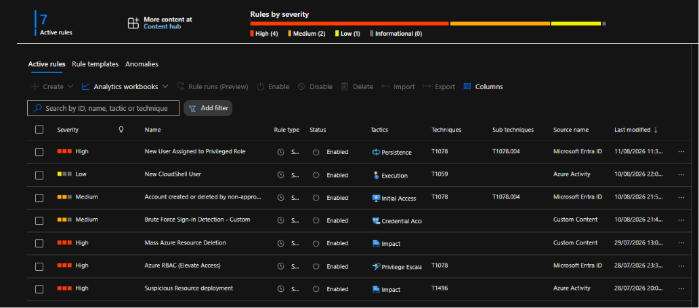
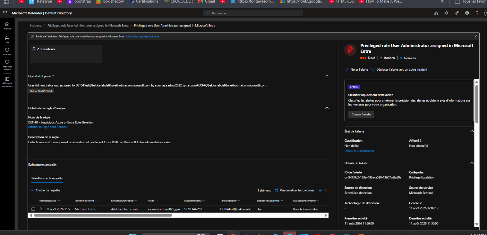
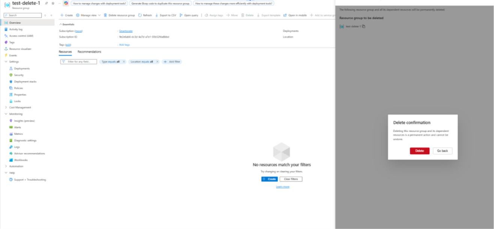
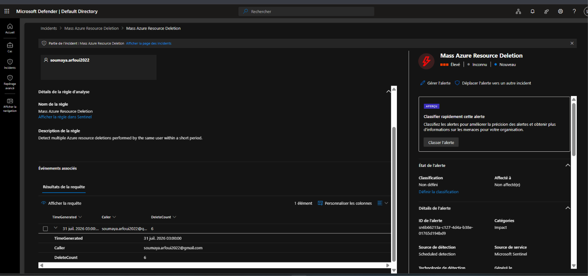
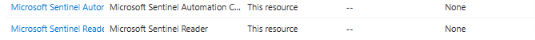
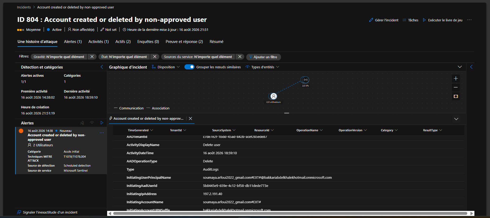
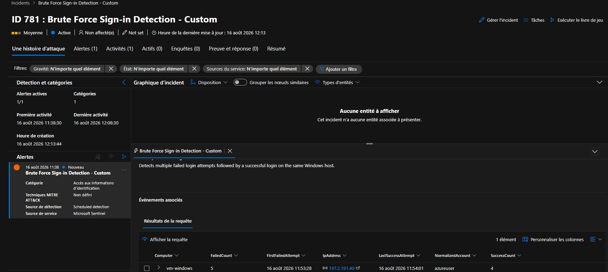
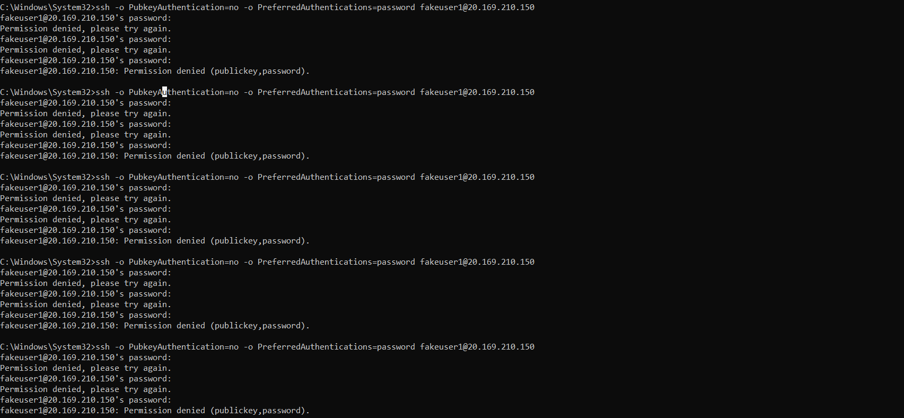
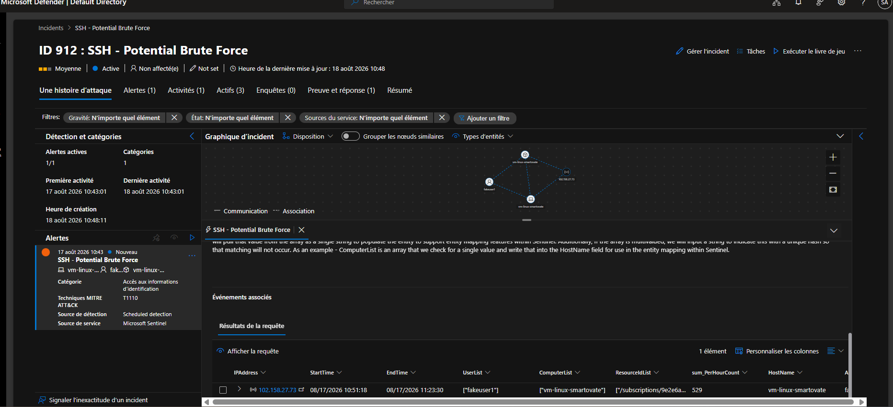

# Cloud-Native SIEM — Azure Monitor & Microsoft Sentinel

## Description
Internship project (Smartovate Ltd) to deploy a cloud-native SIEM on Microsoft Azure. The project centralizes security event logs (identity, activity, endpoint) into a Log Analytics Workspace and layers Microsoft Sentinel on top for detection, correlation, and incident response — built and documented across four agile sprints.

## Languages and Utilities Used
- **Microsoft Azure Portal**
- **Microsoft Sentinel**
- **Azure Monitor / Log Analytics Workspace**
- **KQL** (Kusto Query Language)
- **Microsoft Entra ID**
- **Azure Monitor Agent (AMA) & Data Collection Rules**

## Environments Used
- **Azure subscription:** Smartovate (shared class tenant)
- **Region:** East US
- **Resource group:** `rg-siem-project` *(redacted — see note below)*

> **Note on redaction:** this version replaces the personal Gmail/Hotmail-derived account names and real source IP addresses from the working log with placeholders (`analyst@example.com`, `contoso.onmicrosoft.com`, and RFC 5737 documentation-range IPs like `203.0.113.x`). This is a portfolio/public-repo copy — swap the resource group name back to your own if you're using this internally.

## Sprint Division

| Sprint | Epic | Focus | Status |
|---|---|---|---|
| [Sprint 1](#sprint-1--base-infrastructure) | Epic 1 — Base Infrastructure | Log Analytics Workspace + Sentinel activation | ✅ Complete |
| [Sprint 2](#sprint-2--data-source-integration) | Epic 2 — Data Source Integration | Entra ID logs, Azure Activity logs, AMA on VMs | ✅ Complete |
| [Sprint 3](#sprint-3--threat-detection) | Epic 3 — Threat Detection and Alerting | Native detection rules, custom KQL rules | ✅ Complete |
| [Sprint 4](#sprint-4--visualization-and-reporting) | Epic 4 — Visualization and Reporting | Identity monitoring workbook | 🔶 In progress (planning) |

---

## Sprint 1 — Base Infrastructure

**Epic 1:** Deployment and Configuration of the Base Infrastructure
**Status:** ✅ Complete

### Description
Deploy the foundational logging backbone for the SIEM: a centralized Log Analytics Workspace, and Microsoft Sentinel activated on top of it with correct RBAC access.

### US 1.1 — Creation of the Log Analytics Workspace

*As a security engineer, I want to deploy a Log Analytics Workspace, in order to centralize the storage of all event logs.*
**Priority:** High

| Acceptance criteria | Status | Evidence |
|---|---|---|
| Workspace created in the appropriate Azure region | ✅ Done | `law-smartovate-siem`, region East US, resource group `rg-siem-project` |
| Data retention configured to a minimum of 90 days | ✅ Done | 90-day retention (free tier while Sentinel is active) |
| Billing and environment tags applied | ✅ Done | Tag `project: SIEM-Sentinel` |

### US 1.2 — Activation of Microsoft Sentinel

*As a security engineer, I want to activate Microsoft Sentinel on the Log Analytics Workspace, in order to benefit from SIEM capabilities.*
**Priority:** High

| Acceptance criteria | Status | Evidence |
|---|---|---|
| Sentinel successfully activated on the target workspace | ✅ Done | Activated on `law-smartovate-siem`, 31-day free trial (10 GB/day, until 17/08/2026) |
| RBAC roles (Sentinel Contributor, Sentinel Reader) defined and assigned | ✅ Done | Confirmed via Access control (IAM) → Check access: Sentinel Contributor, Sentinel Reader, Sentinel Automation Contributor |

### Issue Encountered & Resolved
**Problem:** Guest account (Gmail-based) could not be found via the standard "Select members" search when assigning Sentinel roles — an Entra ID guest-enumeration restriction.
**Resolution:** Subscription Owner assigned the roles directly, bypassing the search.
**Verification:** Confirmed via Access control (IAM) → Check access.

### Sprint 1 Summary

| User Story | Completion |
|---|---|
| US 1.1 — Log Analytics Workspace | ✅ 100% |
| US 1.2 — Microsoft Sentinel activation | ✅ 100% |

**Sprint 1 status: fully complete, no open blockers.**

---

## Sprint 2 — Data Source Integration

**Epic 2:** Data Source Integration
**Status:** ✅ Complete

### Description
Connect the SIEM's core data sources: Microsoft Entra ID identity logs, Azure Activity (resource-level) logs, and endpoint telemetry from test VMs via the Azure Monitor Agent — so Sentinel has real data to detect against in Sprint 3.

### US 2.1 — Connecting Azure Active Directory logs

*As a cloud administrator, I want to connect Azure AD sign-in and audit logs to Sentinel, in order to monitor authentications and identity changes.*
**Priority:** High

| Acceptance criteria | Status | Evidence |
|---|---|---|
| The Azure Active Directory (Microsoft Entra ID) data connector is enabled | ✅ Done | Data connectors → Microsoft Entra ID shows **Connected** status, live ingestion graph, last log ~8 min ago |
| The "SigninLogs" and "AuditLogs" tables are visible in the KQL query interface | ✅ Done | `SigninLogs \| take 10` and `AuditLogs \| take 10` both return real rows (sign-in activity, user/password/security-info updates) |
| Maximum delay of 15 minutes between an event and its appearance in Sentinel | ✅ Done | `SigninLogs \| extend delay = ingestion_time() - TimeGenerated \| project TimeGenerated, ingestion_time(), delay \| take 5` — tested over Last 24 hours and re-tested over Last 7 days: delay consistently between ~45 seconds and ~1.5 minutes, well within the 15-minute requirement |

#### Issue Encountered & Resolved
**Problem:** Earlier testing (Sprint 2 start) showed an ingestion delay of roughly 30 minutes for SigninLogs, exceeding the 15-minute acceptance criterion.
**Resolution:** No manual fix applied — re-tested later in the sprint once the Entra ID connector and ingestion pipeline had stabilized. A 7-day sample confirmed consistent delay under 2 minutes.
**Verification:** KQL delay query re-run across a 24-hour and a 7-day window, both showing sub-2-minute delay.

### US 2.2 — Collecting Azure Activity logs

*As a security analyst, I want to ingest Azure Activity logs, in order to trace changes made to infrastructure resources.*
**Priority:** Medium

| Acceptance criteria | Status | Evidence |
|---|---|---|
| The Azure Activity connector is configured via diagnostic settings at the subscription level | ✅ Done | Diagnostic setting created under Subscriptions → Activity log → Diagnostic settings, destination = `law-smartovate-siem` |
| Resource creation, modification, and deletion events flow into the AzureActivity table | ✅ Done | `AzureActivity \| take 10` returns real events (e.g., VIRTUALMACHINES/START/ACTION, WORKSPACES/WRITE) across multiple resource groups |

#### Issue Encountered & Resolved
**Problem:** The standard Content Hub "Azure Activity" connector requires configuration via Azure Policy, which requires the Owner role at the subscription level — held only by Contributor, which explicitly excludes `Microsoft.Authorization/PolicyAssignments/write`.
**Resolution:** Bypassed the Policy-based connector by creating a direct diagnostic setting on the subscription's Activity log, pointing to the Log Analytics workspace — achieves the same data flow without requiring Owner-level Policy permissions.
**Verification:** `AzureActivity` table populated with live events; diagnostic setting visible and enabled in the portal.

### US 2.3 — Deployment of the Azure Monitor Agent on VMs

*As a systems engineer, I want to deploy the Azure Monitor Agent (AMA) on a sample of virtual machines, in order to collect system events (Windows Event Logs / Syslog).*
**Priority:** High

| Acceptance criteria | Status | Evidence |
|---|---|---|
| A Data Collection Rule (DCR) is created to specify which events to collect | ✅ Done | DCR created and associated with both `vm-windows` and the Linux VM, specifying Windows Security Events and Syslog facilities |
| AMA agent installed on at least one Windows VM and one Linux VM | ✅ Done | Extensions on `vm-windows` show AzureMonitorWindowsAgent Running; Linux VM shows AzureMonitorLinuxAgent Running |
| Security events (e.g., Event ID 4624) ingested into the SecurityEvent table | ✅ Done | `SecurityEvent \| where EventID == 4624 \| take 10` returns real sign-in events from `vm-windows` |

#### Issue Encountered & Resolved
**Problem:** VM quota blocker — the B-series VM family was capped at 4 vCPUs subscription-wide, fully used, blocking creation of the second (Linux) test VM.
**Resolution:** Self-service quota increase request submitted via Azure "Manage Quota" — approved instantly, raising the limit from 4 to 8 vCPUs.
**Verification:** Both `vm-windows` and the Linux VM created and running without further quota errors.

### Sprint 2 Summary

| User Story | Completion |
|---|---|
| US 2.1 — Connect Azure AD (Entra ID) logs | ✅ 100% |
| US 2.2 — Collect Azure Activity logs | ✅ 100% |
| US 2.3 — Deploy AMA on Windows + Linux VMs | ✅ 100% |

**Sprint 2 status: fully complete. Two workarounds documented (diagnostic-setting bypass for Azure Activity, VM quota self-service increase); ingestion delay re-tested and confirmed within acceptance criteria after an initial ~30-minute observation.**

---

## Sprint 3 — Threat Detection

**Epic 3:** Threat Detection and Alerting
**Status:** ✅ Complete

**Purpose of this section:** a detailed working record of how each active Sentinel rule was tested — what the rule does, what action was taken to trigger it, where to find the proof, and why it matters.

**Active rules overview (7 total — 4 High, 3 Medium):**

| # | Rule | Severity | Type | Status |
|---|---|---|---|---|
| 1 | New User Assigned to Privileged Role (DET-10) | High | Native | ✅ Fully tested & confirmed |
| 2 | Mass Azure Resource Deletion | High | Custom | ✅ Fully tested & confirmed |
| 3 | Azure RBAC (Elevate Access) | High | Native | ✅ Fully tested & confirmed |
| 4 | Suspicious Resource Deployment | High | Native | ⏳ Not yet tested |
| 5 | Account created or deleted by non-approved user | Medium | Native | 🔶 Configured, test pending confirmation |
| 6 | Brute Force Sign-in Detection – Custom | Medium | Custom | ✅ Fully tested & confirmed |
| 7 | SSH - Potential Brute Force | Medium | Native | ✅ Fully tested & confirmed |

*(Correction from an earlier draft of this log: rule 7 was previously listed as "New CloudShell User" in the summary table, but the rule actually built and tested was "SSH - Potential Brute Force." The table above reflects what was actually tested.)*

**All 7 active rules (overview screenshot):**


---

### 1. New User Assigned to Privileged Role — ✅ Confirmed

**Severity:** High | **Tactic:** Privilege Escalation (T1078) | **Source:** Microsoft Entra ID
**Actual underlying rule name shown in Defender:** *DET-10 - Suspicious Azure or Entra Role Elevation*

#### What it detects
Flags when a privileged Azure RBAC or Microsoft Entra administrative role is assigned or activated for an account that didn't already hold it. The KQL specifically compares the current hour's role assignments against the prior 14 days (`join kind=leftanti`) — so it only fires on a **genuinely new** privilege grant, not a routine reassignment or PIM renewal.

#### Why this matters
This is the classic privilege-escalation attack pattern: an attacker compromises a low-privilege account, then quietly grants it admin rights. Catching *new* admin-role grants (not just any admin activity) is the strongest, least-noisy signal of this happening.

#### Test scenario — what was actually done
1. Confirmed via Entra ID that the account had **Global Administrator** rights (separate from Azure subscription RBAC, where only Contributor was held)
2. Went to **Entra ID → Roles and administrators → User Administrator → + Add assignments**
3. Selected assignment type **Active** (not Eligible/PIM — Eligible roles don't log an audit event until manually activated)
4. Assigned the role to a pre-existing test account: **`DET04 entra Brute Force Test`** (`DET04Test@contoso.onmicrosoft.com`) — chosen because it was already a dedicated test account in the shared tenant, safer than using a real classmate's account
5. Confirmed the raw event landed in `AuditLogs`:
   ```kql
   AuditLogs
   | where TimeGenerated between (datetime(2026-08-11T10:49:55Z) .. datetime(2026-08-11T10:50:05Z))
   | project TimeGenerated, ActivityDisplayName, Category, InitiatedBy, TargetResources
   ```
   Confirmed: `ActivityDisplayName = "Add member to role"`, `Category = "RoleManagement"`
6. Waited ~19 minutes for the scheduled rule run

#### Where the evidence lives
- **Incident #495**, title: *"Privileged role User Administrator assigned in Microsoft Entra"*
- Severity: **Élevé (High)** — correct
- Alert detail panel shows full plain-language explanation: *"User Administrator was assigned to DET04Test@contoso.onmicrosoft.com by analyst_gmail.com#EXT#@contoso.onmicrosoft.com"*
- Structured event table confirms: Actor, ActorIPAddress (203.0.113.10), TargetIdentity (DET04), TargetPrincipalType (User), AssignedRoleName (User Administrator)
- MITRE category: **Privilege Escalation**
- First/last activity: 11:50:00 — Generated: 12:09:19 (≈19 min detection latency)

**Incident detail screenshot:**


---

### 2. Mass Azure Resource Deletion — ✅ Confirmed

**Severity:** High | **Tactic:** Impact | **Source:** Custom Content (custom KQL rule)

#### What it detects
Counts resource deletions per user within a rolling 10-minute window. Fires when the same person deletes 5 or more resources in that window.

```kql
AzureActivity
| where OperationNameValue has "delete"
| where ActivityStatusValue == "Success"
| summarize DeleteCount = count() by Caller, bin(TimeGenerated, 10m)
| where DeleteCount >= 5
```

#### Why this matters
A single deletion is normal cleanup. Five-plus deletions by the same account in a short window is a pattern — either a scripted mass-cleanup gone wrong, or an attacker destroying evidence or infrastructure. The threshold is what separates routine housekeeping from something alert-worthy.

#### Test scenario — what was actually done
Created and then deleted 6 separate test resources (resource groups) in quick succession, all under the same account, within the rule's 10-minute window — comfortably clearing the `DeleteCount >= 5` threshold.

Note on evidence: only one deletion is shown as a representative screenshot below (the `test-delete-1` resource group) rather than all 6 individually — the incident evidence (`DeleteCount = 6`) is what confirms the full test was carried out correctly.

#### Where the evidence lives
- Incident: "Mass Azure Resource Deletion", severity Élevé (High) — correct, matches rule config
- Alert detail confirms: Caller = `analyst@example.com`, DeleteCount = 6, TimeGenerated = 31 juil. 2026 03:00:00
- Alert category: Impact — matches MITRE tactic mapping
- Detection source: Scheduled detection, Microsoft Sentinel

Test action (one representative example — `test-delete-1` resource group, one of 6 deletions performed):


Incident evidence (confirms all 6 deletions were detected, DeleteCount = 6):


---

### 3. Azure RBAC (Elevate Access) — ✅ Confirmed

**Severity:** High | **Tactic:** Privilege Escalation (T1078) | **Source:** Microsoft Entra ID (native template)

#### What it detects
Detects when a Global Administrator uses the "Access management for Azure resources" toggle to elevate their own access — this grants User Access Administrator at the tenant's root scope, meaning full access to every subscription and management group in the tenant. It's one of the most powerful privilege-escalation actions available in Azure, since it goes from "identity admin" to "resource owner everywhere" with a single toggle.

```kql
AuditLogs
| where Category =~ "AzureRBACRoleManagementElevateAccess"
| where ActivityDisplayName =~ "User has elevated their access to User Access Administrator for their Azure Resources"
| extend Actor = tostring(InitiatedBy.user.userPrincipalName)
| extend IPAddress = tostring(InitiatedBy.user.ipAddress)
| project TimeGenerated, Actor, OperationName, IPAddress, Result, LoggedByService
```

#### Why this matters
This toggle is legitimate but rarely used — most Global Admins never need Azure resource access, since identity administration and resource administration are normally separate permission systems. Any use of it should be reviewed, since it's an easy way for a compromised admin account (or an insider) to gain sweeping resource-level control.

#### Test scenario — what was actually done
1. Went to **Entra ID → Properties**
2. Found the "Access management for Azure resources" toggle, currently showing the account already has Global Administrator rights in this tenant
3. Toggled it to **Yes**
4. Portal immediately confirmed: *"This account can manage access to all Azure subscriptions and management groups in this tenant"* — with a visible warning banner: *"You have 1 users with elevated access. Microsoft Security recommends deleting access for users who have unnecessary elevated access."*

Toggle enabled — evidence:


#### Where the evidence lives
- Incident ID 31: "Azure RBAC (Elevate Access)", severity Élevé (High)
- First activity: 30 juil. 2026 22:56:07 — Last activity: 23:12:11 — Alert generated: 23:38:30
- Alert category: Réaffectation de privilèges (Privilege reassignment)
- MITRE technique: T1078
- Alert description (auto-generated by the template) confirms exact match to the rule's purpose: *"Detects when a Global Administrator elevates access to all subscriptions and management groups in a tenant..."*
- Entity graph shows the account and source IP (203.0.113.40)

Incident evidence:


---

### 4. Suspicious Resource Deployment — ⏳ Not yet tested

**Severity:** High | **Tactic:** Impact (T1496) | **Source:** Azure Activity (native template)

#### What it detects
Native template looking for anomalous resource deployment patterns — e.g. deployments via unusual methods, unexpected regions, or naming patterns inconsistent with normal activity.

#### Test scenario — what to do
Deploy a resource via an unusual method (e.g. a raw ARM/Bicep template deployment rather than the normal portal "Create resource" flow), or deploy into a region not otherwise used in this project.

#### Where to look for evidence
Sentinel → Incidents, filtered to this rule name, after the deployment and the rule's next scheduled run.

---

### 5. Account created or deleted by non-approved user — 🔶 Configured, pending confirmation

**Severity:** Medium | **Tactic:** Initial Access (T1078, T1078.004) | **Source:** Microsoft Entra ID (native template, blocklist-based)

#### What it detects
Watches for `AuditLogs` "Add user" / "Delete user" events performed by a specific listed account. Original template design: put a *known bad* account in the list, get alerted if they create/delete users.

#### Configuration used
```kql
let nonapproved_users = dynamic(["analyst_gmail.com#EXT#@contoso.onmicrosoft.com"]);
let nonapproved_apps = dynamic([]);
AuditLogs
| where OperationName =~ "Add user" or OperationName =~ "Delete user"
| where Result =~ "success"
| extend InitiatingUserPrincipalName = tostring(InitiatedBy.user.userPrincipalName)
| where InitiatingUserPrincipalName has_any (nonapproved_users) or InitiatingAppName has_any (nonapproved_apps)
```
Own guest UPN used as the "watched" account — a pragmatic choice for a shared classroom tenant where a full allowlist of ~35 students isn't realistic.

#### Test scenario — what to do
1. Entra ID → Users → **+ New user** → create a throwaway test user (e.g. `test-detection-user`)
2. Delete that same test user shortly after

#### Where to look for evidence
```kql
AuditLogs
| where TimeGenerated > ago(30m)
| where OperationName =~ "Add user" or OperationName =~ "Delete user"
| where InitiatedBy.user.userPrincipalName has "analyst"
```
Then Sentinel → Incident:


---

### 6. Brute Force Sign-in Detection – Custom — ✅ Confirmed

**Severity:** Medium | **Tactic:** Credential Access | **Source:** Custom Content (custom KQL rule, Windows SecurityEvent)

#### What it detects
Detects multiple failed Windows login attempts followed by a successful login on the same host. Unlike the Entra ID sign-in brute-force pattern, this rule reads `SecurityEvent` (collected by AMA from `vm-windows`), watching specifically for Event ID 4625 (failed logon) and Event ID 4624 (successful logon) for the same account/computer/IP combination.

```kql
SecurityEvent
| where TimeGenerated >= ago(1h)
| where EventID in (4624, 4625)
| extend NormalizedAccount = tolower(tostring(split(Account, "\\")[1]))
| summarize
    FailedCount = countif(EventID == 4625),
    SuccessCount = countif(EventID == 4624),
    FirstFailedAttempt = minif(TimeGenerated, EventID == 4625),
    LastSuccessAttempt = maxif(TimeGenerated, EventID == 4624)
    by NormalizedAccount, Computer, IpAddress
| where FailedCount >= 5 and SuccessCount > 0
| where LastSuccessAttempt > FirstFailedAttempt
```

#### Why this matters
A failed login followed eventually by a success is normal (a typo, a forgotten password). But 5+ failures immediately followed by a success, for the same account on the same host, is the classic signature of either a successful brute-force attack or a legitimate user under active attack who happened to succeed after the attacker gave up.




---

### 7. SSH - Potential Brute Force — ✅ Confirmed

**Severity:** Medium | **Tactic:** Credential Access (T1110) | **Source:** Syslog (native template)

#### What it detects
An IP with 15+ failed SSH attempts against invalid usernames, in a 4-hour block, grouped by IP + username.

```kql
let threshold = 15;
Syslog
| where ProcessName =~ "sshd"
| where SyslogMessage contains "Failed password for invalid user"
| parse kind=relaxed SyslogMessage with * "invalid user " user " from " ip " port" port " ssh2" *
| distinct TimeGenerated, Computer, user, ip, port, SyslogMessage, _ResourceId
| summarize PerHourCount = count() by bin(TimeGenerated,4h), ip, Computer, user
| where PerHourCount > threshold
```

#### Blocker overcome
Linux VM uses SSH key-only auth by default. Root cause: an override in `/etc/ssh/sshd_config.d/60-cloudimg-settings.conf` re-disabling password auth. Fixed by patching that file and restarting `ssh`.

#### 🐛 Design limitation found
The rule groups by `user`. Spreading attempts across many different fake usernames (once each) never crossed the threshold — a real attacker spraying usernames would evade this rule. **Fix used for testing:** repeated one username (`fakeuser1`) many times instead; confirmed `PerHourCount = 23`.

#### Test scenario
```bash
ssh -o PubkeyAuthentication=no -o PreferredAuthentications=password fakeuser1@<linux-vm-ip>
```
Repeated with wrong passwords.



#### Where the evidence lives
Incident ID 912, Severity Medium, Category Credential Access, MITRE T1110. IPAddress 203.0.113.73, UserList `["fakeuser1"]`, ComputerList `["vm-linux-smartovate"]`.



**Cleanup:** revert SSH config to key-only, deallocate the VM, close duplicate incidents #910/#911.

### Sprint 3 Summary

| # | Rule | Status |
|---|---|---|
| 1 | New User Assigned to Privileged Role | ✅ Confirmed |
| 2 | Mass Azure Resource Deletion | ✅ Confirmed |
| 3 | Azure RBAC (Elevate Access) | ✅ Confirmed |
| 4 | Suspicious Resource Deployment | ⏳ Not yet tested |
| 5 | Account created/deleted by non-approved user | 🔶 Pending confirmation |
| 6 | Brute Force Sign-in Detection – Custom | ✅ Confirmed |
| 7 | SSH - Potential Brute Force | ✅ Confirmed |

**Sprint 3 status: 5 of 7 rules fully confirmed with incident evidence, 1 configured and pending a final confirmed fire, 1 not yet tested. One meaningful detection gap discovered and documented (username-spray evasion on the SSH rule).**

---

## Sprint 4 — Visualization and Reporting

**Epic 4:** Visualization and Reporting
**Status:** 🔶 In progress (planning)

### Description
Sprints 1–3 built the pipeline (ingestion) and the detections (alerting). Sprint 4 adds the layer a security manager actually looks at day-to-day: a workbook that turns raw `SigninLogs` into trend lines and a map, so identity risk can be read at a glance instead of queried KQL-by-KQL. This is also where the project starts producing something reviewable by a non-analyst stakeholder — the workbook is the natural artifact to screenshot for a stakeholder update or a portfolio walkthrough.

### US 4.1 — Creation of an Identity Monitoring Workbook

*As a security manager, I want to have an interactive dashboard, in order to visualize authentication trends and identity-related anomalies.*
**Priority:** Medium
**Status:** ⬜ Not started (planned)

| Acceptance criteria | Status | Planned implementation |
|---|---|---|
| The workbook displays the number of successful vs. failed sign-ins per day | ⬜ Pending | Time-chart visualization over `SigninLogs`, bucketed by day, split by `ResultType == 0` (success) vs. non-zero (failure) |
| A geographic map shows the origin of sign-ins | ⬜ Pending | Map visualization using `LocationDetails` (city/country/lat-long) from `SigninLogs`, sized or colored by sign-in volume |
| Data refreshes automatically | ⬜ Pending | Workbook's built-in auto-refresh interval set (e.g. 5 or 15 min), plus a relative time-range parameter (Last 24h / 7d) rather than a fixed date filter |

#### Why this matters
Sprint 3's rules are good at telling you *something specific and bad just happened* (a new admin grant, a brute-force success). What they don't give a security manager is the everyday baseline: is failed-sign-in volume trending up this week, is there a spike in sign-ins from a country nobody on the team is in, is one identity generating a disproportionate share of failures. A workbook answers "is something drifting" — a category of question the scheduled rules aren't built to answer, since they fire on discrete thresholds rather than surfacing trend shape. It's also the artifact most likely to be shown to someone non-technical, so it needs to read clearly at a glance, not just be technically correct.

#### Planned approach

**1. Successful vs. failed sign-ins per day**
```kql
SigninLogs
| summarize
    Success = countif(ResultType == "0"),
    Failure = countif(ResultType != "0")
    by bin(TimeGenerated, 1d)
| render timechart
```
In the workbook, this becomes a **time chart** visualization (or stacked column chart) with `Success` and `Failure` as separate series, driven by a workbook time-range parameter rather than a hardcoded window — so the manager can flip between "today," "last 7 days," "last 30 days" without editing the query.

**2. Geographic origin of sign-ins**
```kql
SigninLogs
| where isnotempty(LocationDetails)
| extend City = tostring(LocationDetails.city),
         Country = tostring(LocationDetails.countryOrRegion),
         Lat = todouble(LocationDetails.geoCoordinates.latitude),
         Long = todouble(LocationDetails.geoCoordinates.longitude)
| summarize SignInCount = count() by City, Country, Lat, Long
```
Rendered as the workbook's built-in **Map** visualization type, with `Lat`/`Long` as the location fields and `SignInCount` driving marker size — gives an immediate visual of whether sign-in origins match expected geography (e.g. flags a spike from a country outside the normal user base, which is a common early indicator worth cross-checking against the brute-force and impossible-travel-style detections from Sprint 3).

**3. Auto-refresh**
Workbook-level setting (gear icon → Auto refresh), set to a short interval (5–15 min) appropriate for a live-monitoring view, combined with a relative (not absolute) time-range parameter so the whole workbook — chart and map — moves forward automatically without manual intervention.

#### Open questions / things to confirm during build
- Whether `LocationDetails` is populated reliably enough in this tenant's `SigninLogs` for the map to be meaningful, or whether a sample query needs to run first to check for nulls/gaps (same kind of pre-check that caught the SSH username-grouping gap in Sprint 3).
- Whether failed sign-ins should be broken down further by `ResultType` reason code (e.g. bad password vs. MFA failure vs. conditional access block) as a secondary chart, since "failed" is currently a single bucket and a manager may want to know *why*.
- Retention/cost: the map and daily chart only need recent data, but it's worth deciding whether the workbook's default time range should match the workspace's 90-day retention or default to something shorter to keep query cost down.

#### Evidence to capture once built
- Screenshot of the time chart showing a visible split between success/failure over at least a few days of real data
- Screenshot of the populated map with at least 2–3 distinct sign-in origins
- Screenshot or short note confirming the auto-refresh setting and the relative time-range parameter, ideally showing the workbook update without a manual reload

---

*Sprint 4 will be updated with Done status, evidence, and screenshots once US 4.1 is built and tested, following the same acceptance-criteria-to-evidence format used in Sprints 1–3.*
